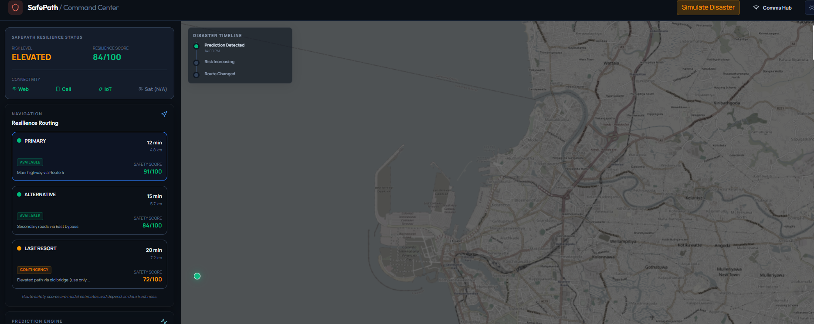
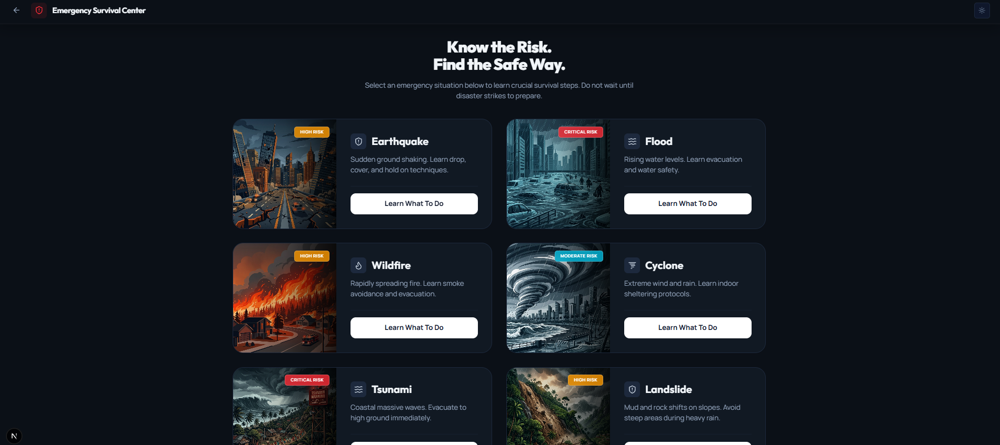
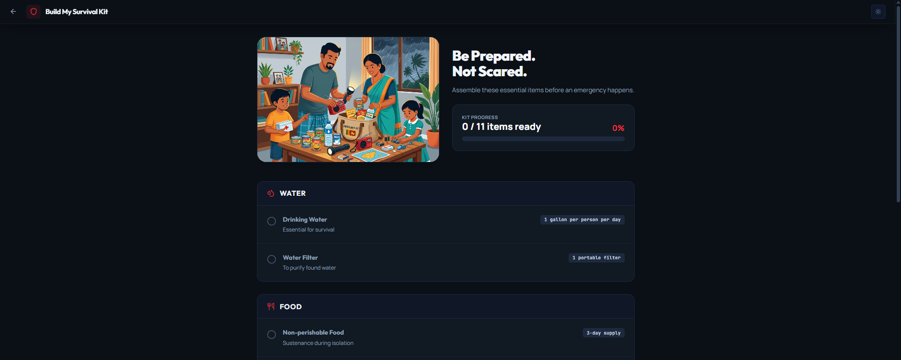
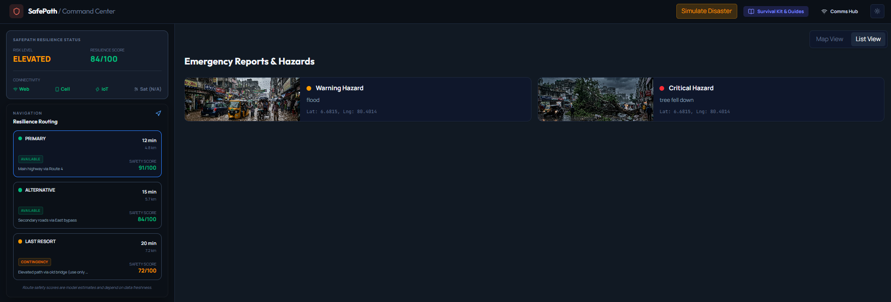
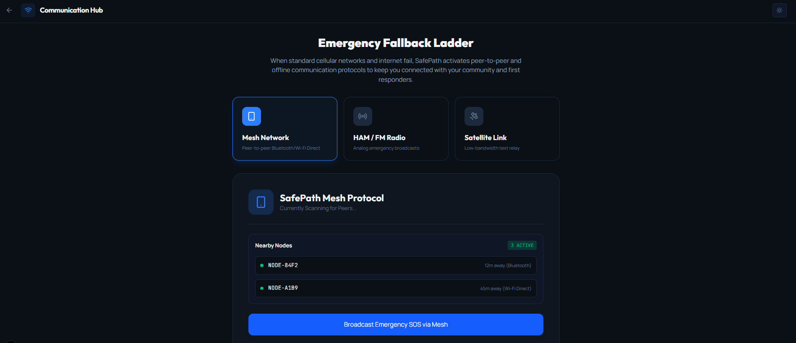
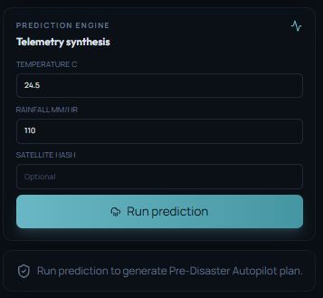
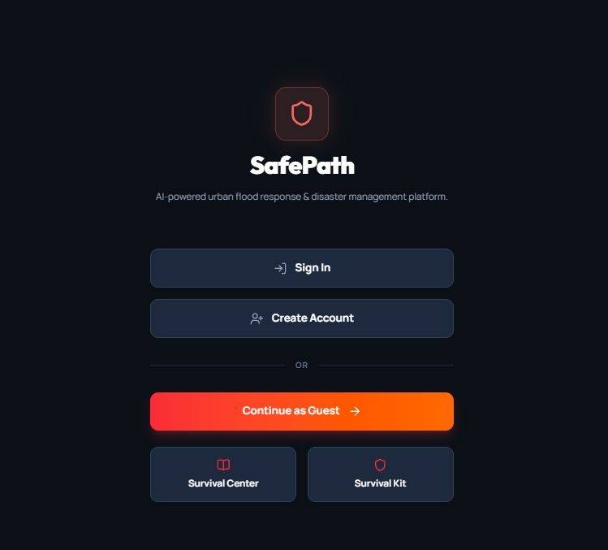
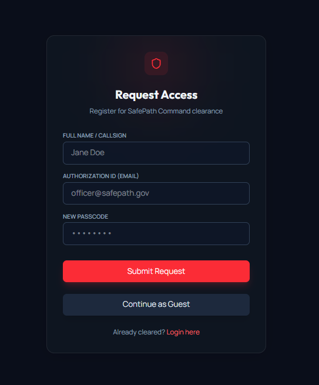
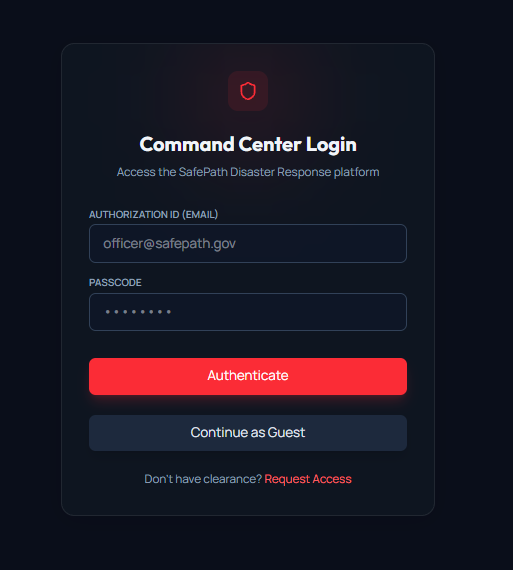
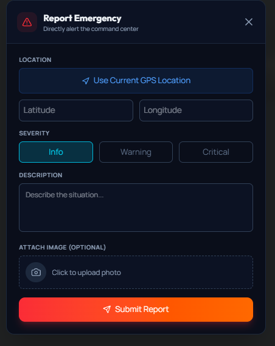

# SafePath: Advanced Disaster Resilience Platform

<p align="center">
  
  
  
  
  
  
  
  
  
  
</p>


## The Problem Statement
During natural disasters like floods, tsunamis, and landslides (especially in vulnerable areas like Sri Lanka), traditional communication networks fail, evacuation routes become unpredictably blocked, and people panic without clear, actionable guidance. Most disaster management websites offer static information that becomes useless when the crisis hits and the internet goes down.

## What is SafePath?
SafePath is an AI-powered, offline-first disaster intelligence and emergency guidance platform. It acts as an adaptive command center that doesn't just show you the weather—it guides you through the crisis step-by-step, even when critical infrastructure fails. 

## How It Works
SafePath utilizes a Next.js frontend combined with a FastAPI/Python risk engine backend. It uses real-time telemetry and Gemini AI to calculate threat levels. When a crisis is imminent, SafePath shifts into **Emergency Mode**. If the internet disconnects, SafePath's Progressive Web App (PWA) capabilities and IndexedDB storage keep the app running, queuing your emergency reports and providing offline fallback communication methods.

## Unique Features Highlighted

### 1. Three-State Operational Architecture (PREPARE → SURVIVE → RECOVER)
- **What it is:** The command center fluidly adapts to connectivity. 
- **How it helps:** You explicitly download an **Emergency Pack** while online (PREPARE). When the internet dies, the UI shifts to **OFFLINE EMERGENCY MODE** showing cached safe routes and shelters (SURVIVE). Once the internet returns, it automatically syncs queued reports (RECOVER).

### 2. Offline SOS Queue & Hazard Reporting
- **What it is:** An offline-first resilient queue using IndexedDB.
- **How it helps:** If you hit the massive "I'M IN DANGER" button while offline, your GPS coordinates are queued locally. SafePath waits patiently and blasts the SOS to the backend the millisecond connectivity is restored.

### 3. Safest Route vs. Fastest Route Reasoning
- **What it is:** Intelligent route options that explain *why* they are safer.
- **How it helps:** The AI-backed router doesn't just give you a path; it provides a "Safe Route" that explains it is bypassing 2 known flood zones and a blocked road, increasing your trust in the system.

### 4. AI Safety Briefing & Community Confidence
- **What it is:** Automated risk summaries based on crowdsourced data.
- **How it helps:** Community reports are grouped to generate a "Confidence" score (e.g. HIGH if reported by 3 people). The AI Safety Briefing distills this into a one-paragraph actionable summary so you don't have to parse raw data in an emergency.

### 5. Competition Demo Mode
- **What it is:** A built-in control panel for judges.
- **How it helps:** Allows anyone to effortlessly simulate an internet outage, trigger a local SOS, simulate hazards, and demonstrate the seamless automatic background synchronization (RECOVER phase) without pulling ethernet cables.

## How This Saves Lives
By combining **offline availability**, **AI-contextualized survival kits**, and **dynamic route recalculation**, SafePath removes panic and hesitation. People know exactly what to do, what to pack, and where to go, even when the internet is entirely cut off.

## Technology Stack
- **Frontend:** Next.js 14, React, TailwindCSS, MapLibre GL
- **Backend:** FastAPI, Python, Google Gemini AI Engine
- **Database / Auth:** Supabase (PostgreSQL), Supabase SSR
- **Offline Storage:** IndexedDB (idb), Service Workers (PWA)

---

## How to Run Locally

### Prerequisites
- Node.js (v22+)
- Python (3.10+)
- A Supabase project

### 1. Backend Setup
```bash
cd backend
python -m venv venv
# Windows: venv\Scripts\activate | Mac/Linux: source venv/bin/activate
pip install -r requirements.txt
```
Create a `.env` file in the `backend` directory:
```env
GEMINI_API_KEY=your_gemini_key_here
```
Run the backend:
```bash
uvicorn app.main:app --reload
```

### 2. Frontend Setup
```bash
cd frontend
npm install
```
Create a `.env.local` file in the `frontend` directory:
```env
NEXT_PUBLIC_SUPABASE_URL=your_supabase_url
NEXT_PUBLIC_SUPABASE_PUBLISHABLE_KEY=your_supabase_anon_key
```
Run the frontend:
```bash
npm run dev
```

Visit `http://localhost:3000` to access the SafePath Command Center!